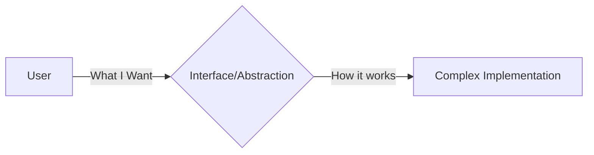

# SC-01: Abstraksi Mendalam

> "Seni menyembunyikan detail yang membosankan."

## 1. Skenario Kekacauan (The Problem)
Tanpa abstraksi, setiap kali ada perubahan kecil (misal: gudang pindah lokasi), Anda harus merubah seluruh kode operasional Anda. Kode Anda menjadi "Ribet" dan sulit dibaca karena tercampur antara logika bisnis dan detail teknis.

## 2. Analogy
Bayangkan Anda sedang menyetir **Mobil**.
- **Procedural (How)**: Anda harus tahu bagaimana menyuntikkan bahan bakar ke mesin, bagaimana memutar roda satu per satu, dan bagaimana mengatur gas secara manual.
- **Abstracted (What)**: Anda hanya perlu tahu cara memutar setir, injak gas, dan injak rem. Mesin di dalam kap mobil adalah "Abstraksi" yang bekerja secara otomatis.

## 3. Everyday Deep Dive
Abstraksi bukan berarti menghilangkan detail. Abstraksi berarti **memisahkan penggunaan dari pembuatan**. Kita membuat "Pintu" (Interface) agar orang bisa masuk tanpa harus tahu bagaimana engsel pintu tersebut dibuat.

## 4. The Blueprint

## 8. Practical Lab
Bandingkan dua gaya berpikir ini untuk memahami mengapa Pattern Library sangat bergantung pada abstraksi:
- [procedural.ts](./procedural.ts) - Cara berpikir langkah-demi-langkah yang kaku.
- [abstracted.ts](./abstracted.ts) - Cara berpikir berbasis tujuan yang fleksibel.
