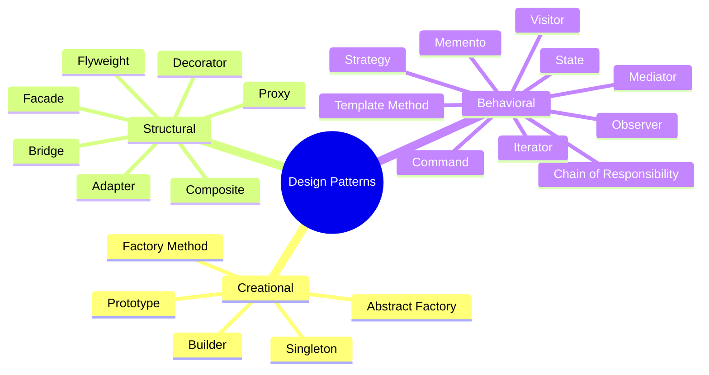

# SC-01: The Grand Map

> "Peta visual 23 Pola Desain."

## 1. Skenario Kekacauan (The Problem)
Mencoba memahami 23 pola sekaligus seperti mencoba membaca seluruh peta dunia dalam satu detik. Anda butuh **Panduan Navigasi**.

## 2. Analogy
Peta ini adalah **Menu Restoran Bintang 5**. Kita tidak akan memesan semua menu sekaligus. Kita memilih menu berdasarkan lapar kita saat itu (Masalah kode kita).

## 4. The Blueprint

## 5. The "Magic" (Decoupling Strategy)
Semua pola ini memiliki satu tujuan rahasia yang sama: **Memisahkan hal yang mudah berubah dari hal yang tetap.**

## 8. Practical Lab
Dalam lab ini, kita akan membuat "Kuis Sederhana" untuk menentukan kategori pola mana yang paling cocok untuk masalah Anda.
(Lihat file pendukung untuk simulasi kuis pilihan pola)
