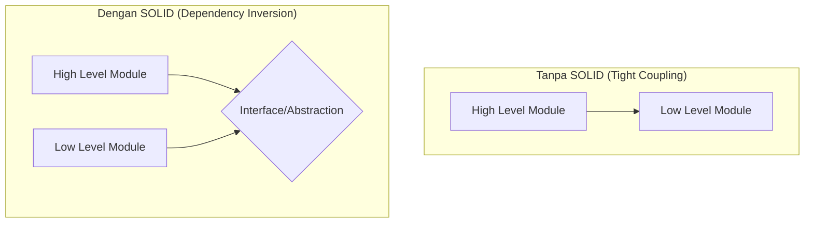

# RAK-02: Foundation & Core Rules (SOLID)

> "Akar dari seluruh pola desain yang kokoh. Tanpa pondasi ini, arsitektur Anda akan roboh saat diterjang perubahan."

## 1. Skenario Kekacauan (The Problem)
Bayangkan Anda memiliki sebuah kelas `SmartPhone`. Di dalamnya Anda menulis logika untuk: membuat panggilan, memproses pembayaran, menyimpan data ke database, dan merender grafik UI. 
- **Masalahnya**: Saat Anda ingin merubah cara pembayaran, Anda tidak sengaja merusak kode pembuat panggilan karena semuanya bertumpuk di satu file yang sama. Inilah yang disebut **Rigid** (kaku) dan **Fragile** (ringkih).

## 2. Analogy
Bayangkan sebuah **Pisau Lipat Swiss** vs **Kotak Perkakas**. 
- Jika pisau lipat Swiss rusak di bagian pembuka botol, Anda mungkin harus membuang seluruh alatnya atau memperbaiki mekanik yang saling terkait. 
- Tapi dengan **SOLID**, kita membangun sistem seperti **Kotak Perkakas**: Jika palu rusak, Anda cukup ganti palu tanpa harus memengaruhi obeng atau gergaji. Setiap alat punya satu tugas, mudah diganti, dan tidak saling merepotkan.

## 3. Everyday Deep Dive (Penjelasan Santai)
SOLID adalah singkatan dari 5 prinsip yang memandu kita memisahkan urusan (Separation of Concerns):
1.  **S - Single Responsibility**: Satu kelas hanya boleh punya **satu alasan untuk berubah**. Jangan jadikan kelas Anda "Tukang Sapu" yang mengerjakan segalanya.
2.  **O - Open/Closed**: Kode Anda harus **terbuka untuk ditambah fitur baru**, tapi **tertutup untuk modifikasi kode lama**. Pakailah "Colokan" (Interface) agar fitur baru tinggal colok.
3.  **L - Liskov Substitution**: Jika Anda punya kelas `Burung` dan anaknya `Penguin`, pastikan `Penguin` bisa menggantikan `Burung` tanpa membuat program *error* (misal: jangan paksa Penguin terbang jika di kelas Burung ada fungsi `terbang()`).
4.  **I - Interface Segregation**: Jangan paksa klien menggunakan fungsi yang tidak mereka butuhkan. Lebih baik punya banyak "Colokan Kecil" yang spesifik daripada satu "Colokan Raksasa" yang membingungkan.
5.  **D - Dependency Inversion**: Jangan biarkan logika penting (Domain) bergantung pada detail teknis (Database/UI). Keduanya harus bergantung pada **Rencana (Abstraksi)**.

## 4. The Blueprint (Structural)

## 5. The "Magic" of Decoupling
Keajaiban SOLID adalah **Isolasi Perubahan**. Saat bos Anda minta ganti database dari MySQL ke MongoDB, Anda hanya perlu membuat satu file baru dan "mencoloknya" ke sistem tanpa merubah logika bisnis utama. Kode Anda menjadi **Flexible** dan **Reusable**.

## 6. Multi-Language Nuances
- **TypeScript**: Menggunakan `interface` secara eksplisit untuk menjaga kontrak.
- **Go**: Menggunakan `interface` secara implisit (*Duck Typing*)—jika bentuknya seperti bebek, maka itu bebek.
- **Rust**: Menggunakan `traits` untuk mendefinisikan perilaku tanpa harus ada hierarki kelas yang kaku.

## 7. Wisdom & Warnings
Hati-hati terjebak dalam **Over-engineering**. Jika Anda hanya membuat skrip kecil 10 baris, tidak perlu menerapkan kelima prinsip SOLID secara brutal. Gunakan SOLID saat sistem Anda mulai tumbuh dan mulai terasa "sakit" saat diubah.

## 8. Practical Lab
Pembelajaran SOLID di Rak ini dikelola dalam hirarki 5-level:
- **[SR-01: SOLID Principles](./SR-01-SOLID-Principles/)**
  - **[BK-01: S - Single Responsibility](./SR-01-SOLID-Principles/BK-01-S-Single-Responsibility/)**
  - **[BK-02: O - Open/Closed](./SR-01-SOLID-Principles/BK-02-O-Open-Closed/)**
  - **[BK-03: L - Liskov Substitution](./SR-01-SOLID-Principles/BK-03-L-Liskov-Substitution/)**
  - **[BK-04: I - Interface Segregation](./SR-01-SOLID-Principles/BK-04-I-Interface-Segregation/)**
  - **[BK-05: D - Dependency Inversion](./SR-01-SOLID-Principles/BK-05-D-Dependency-Inversion/)**
