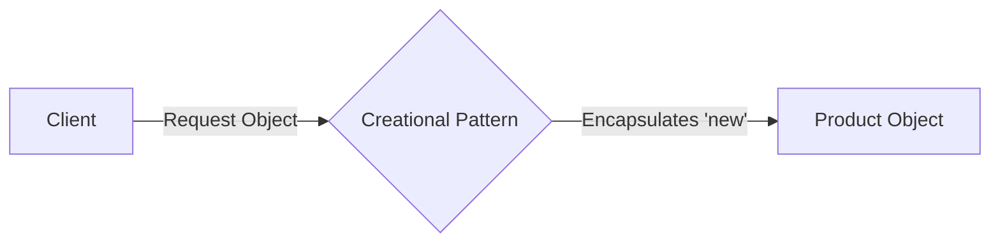

# RAK-03: Evolution & Interfacing (Creational)

> "Seni mengontrol kelahiran objek agar sistem tetap fleksibel dan tidak kaku."

## 1. Skenario Kekacauan (The Problem)
Menggunakan kata kunci `new` secara sembarangan di seluruh aplikasi adalah sebuah jebakan. Bayangkan jika Anda memiliki 100 tempat di kode yang menulis `new MySQLDatabase()`. Saat Anda ingin ganti ke `PostgreSQL`, Anda harus merubah 100 baris tersebut. Kode Anda menjadi "Kaku" dan sulit berevolusi.

## 2. Analogy
Pola Kreasi (Creational) adalah seperti **Sistem Pemesanan di Restoran Bintang 5**. 
- Sebagai pelanggan (Klien), Anda tidak perlu pergi ke dapur dan "membuat" sendiri steak Anda menggunakan pisau dan api.
- Anda hanya perlu memesan lewat menu. Bagaimana steak itu dibuat, bahan apa yang dipilih, dan siapa yang memasaknya adalah urusan dapur (Pola Kreasi).

## 3. Everyday Deep Dive (Penjelasan Santai)
Pola-pola di rak ini fokus pada satu hal: **Menyembunyikan kerumitan pembuatan objek**.
- **Factory Method & Abstract Factory**: Dapur yang menyiapkan objek untuk Anda.
- **Singleton**: Pastikan hanya ada satu "Bos" atau "Database" di seluruh sistem.
- **Builder**: Membangun objek yang super kompleks langkah demi langkah (seperti merakit LEGO).
- **Prototype**: Menggandakan objek yang sudah ada daripada membuat dari nol.

## 4. The Blueprint

## 8. Practical Lab
Peta jalan pembelajaran di Rak ini terbagi menjadi:
- **[SR-01-Creational-Patterns/](./SR-01-Creational-Patterns/)**
  - [BK-01: Factory Method](./SR-01-Creational-Patterns/BK-01-Factory-Method/)
  - [BK-02: Singleton](./SR-01-Creational-Patterns/BK-02-Singleton/)
  - [BK-03: Builder](./SR-01-Creational-Patterns/BK-03-Builder/)
  - [BK-04: Prototype](./SR-01-Creational-Patterns/BK-04-Prototype/)
  - [BK-05: Abstract Factory](./SR-01-Creational-Patterns/BK-05-Abstract-Factory/)
