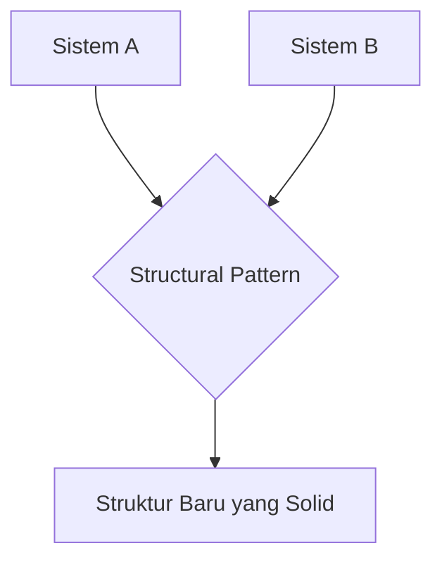

# RAK-04: Core Mechanics & Internals (Structural)

> "Seni menyusun kelas dan objek menjadi struktur yang lebih besar tanpa mengorbankan fleksibilitas."

## 1. Skenario Kekacauan (The Problem)
Pernahkah Anda mencoba menghubungkan dua sistem yang tidak bisa "berbicara" satu sama lain? Atau ingin menambah fitur ke sebuah objek tanpa harus merusak kelas aslinya? Tanpa Pola Struktural (Structural Patterns), Anda akan terjebak dalam kode yang kaku, penuh dengan *hacky solutions*, dan sulit dikelola seiring bertambahnya komponen.

## 2. Analogy
Pola Struktural adalah seperti **Arsitektur Bangunan Modern**. 
- Bagaimana pipa air dihubungkan ke keran? (Adapter).
- Bagaimana cara menambah lapisan insulasi di dinding tanpa merobohkan rumah? (Decorator).
- Bagaimana cara menyatukan seluruh sistem listrik yang rumit ke dalam satu tombol saklar yang mudah ditekan? (Facade).

## 3. Everyday Deep Dive (Penjelasan Santai)
Pola-pola di rak ini fokus pada **Komposisi Objek**:
- **Adapter**: "Colokan Konverter" untuk interface yang beda.
- **Decorator**: "Bungkus Tambahan" untuk menambah fungsi.
- **Facade**: "Satu Tombol" untuk menyembunyikan kerumitan internal.
- **Composite**: Mengelola struktur "Pohon" (seperti folder file).
- **Proxy**: "Satpam" atau pengganti untuk kontrol akses.

## 4. The Blueprint

## 8. Practical Lab
Struktur navigasi rak ini mengikuti **Hirarki 5-Level**:
- **[SR-01-Structural-Patterns/](./SR-01-Structural-Patterns/)**
  - [BK-01: Adapter](./SR-01-Structural-Patterns/BK-01-Adapter/)
  - [BK-02: Decorator](./SR-01-Structural-Patterns/BK-02-Decorator/)
  - [BK-03: Facade](./SR-01-Structural-Patterns/BK-03-Facade/)
