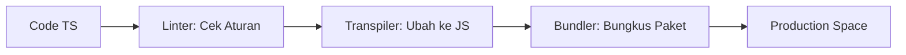

# RAK-05: Ecosystem & Tooling

> "Sebagus-bagusnya kode, ia butuh panggung yang kokoh untuk bisa berjalan dengan cepat dan aman."

## 1. Skenario Kekacauan (The Problem)
Pernahkah Anda mencoba menjalankan kode TypeScript di browser tapi gagal karena browser tidak mengerti sintaksnya? Atau Anda menulis ribuan baris kode yang penuh dengan typo karena tidak ada alat yang mengingatkan Anda? Tanpa **Ecosystem & Tooling**, pengerjaan proyek software akan terasa seperti membangun gedung pencakar langit menggunakan palu kayu. Lambat, berbahaya, dan melelahkan.

## 2. Analogy
Ecosystem & Tooling adalah seperti **Workshop (Bengkel)** bagi seorang pengrajin. 
- Anda punya pola desain (Design Patterns) sebagai teknik ukir.
- Tapi Anda butuh Meja kerja (IDE), Alat Serut Otomatis (Bundlers), dan Penggaris digital (Linters) agar karya Anda presisi dan selesai tepat waktu.

## 3. Everyday Deep Dive (Penjelasan Santai)
Rak ini membahas "Sabuk Alat" (Toolbelt) seorang engineer modern:
- **Transpilers (SWC/Babel)**: Penerjemah bahasa gaul (Modern TS) ke bahasa kuno (Old JS).
- **Bundlers (Vite/Rollup)**: Tukang bungkus yang merapikan ribuan file menjadi satu paket hemat.
- **Linters (ESLint)**: Satpam yang menegur kalau cara nulis Anda berantakan.
- **Testing (Jest/Vitest)**: Tim Quality Control yang memastikan mesin Anda tidak meledak saat dijalankan.

## 4. The Blueprint (The Pipeline)

## 8. Practical Lab
Struktur navigasi rak ini mengikuti **Hirarki 5-Level**:
- **[SR-01-Tooling-Philosophy/](./SR-01-Tooling-Philosophy/)**: Mengapa kita butuh alat?
- **[SR-02-Modern-Stack/](./SR-02-Modern-Stack/)**:
  - [BK-01: Bundlers & Transpilers](./SR-02-Modern-Stack/BK-01-Bundlers-Transpilers/)
  - [BK-02: Quality Gates](./SR-02-Modern-Stack/BK-02-Quality-Gates/)
