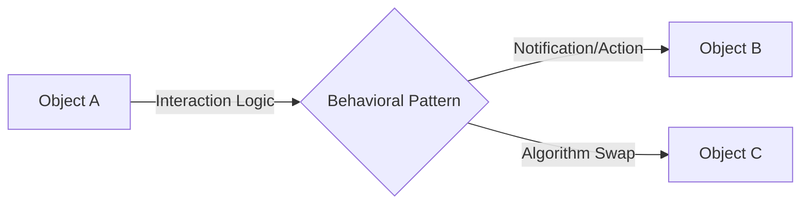

# RAK-06: The Underworld (Behavioral)

> "Seni mengelola komunikasi, arus data, dan tanggung jawab antar objek agar sistem tetap hidup dan reaktif."

## 1. Skenario Kekacauan (The Problem)
Pernahkah Anda menulis kode di mana sebuah objek harus tahu detail cara kerja 5 objek lainnya hanya untuk mengirim sebuah pesan? Atau sebuah kelas yang memiliki `if-else` sepanjang 500 baris hanya untuk menangani berbagai kondisi perilaku? Tanpa Pola Perilaku (Behavioral Patterns), interaksi antar objek Anda akan menjadi benang kusut yang mustahil diurai saat terjadi bug.

## 2. Analogy
Pola Perilaku adalah seperti **Hubungan Sosial dan Protokol Komunikasi**.
- Bagaimana sebuah berita tersebar ke seluruh warga kota secara otomatis? (Observer).
- Bagaimana seorang prajurit mengganti senjatanya sesuai kondisi medan perang? (Strategy).
- Bagaimana sebuah lampu lalu lintas merubah perilakunya dari Hijau ke Merah? (State).

## 3. Everyday Deep Dive (Penjelasan Santai)
Pola-pola di rak ini fokus pada **Interaksi dan Algoritma**:
- **Observer**: "Sistem Langganan" (Subscription) agar semua tahu saat ada perubahan.
- **Strategy**: "Gonta-ganti Jurus" (Algoritma) tanpa merubah orangnya.
- **State**: "Perubahan Sifat" (Behavior) saat suasana hati (State) berubah.
- **Command**: "Surat Perintah" yang bisa disimpan, dibatalkan (Undo), atau dijadwalkan.
- **Iterator**: "Cara Keliling" koleksi data tanpa perlu tahu struktur dalamnya.

## 4. The Blueprint

## 8. Practical Lab
Struktur navigasi rak ini mengikuti **Hirarki 5-Level**:
- **[SR-01-Behavioral-Patterns/](./SR-01-Behavioral-Patterns/)**
  - [BK-01: Observer](./SR-01-Behavioral-Patterns/BK-01-Observer/)
  - [BK-02: Strategy](./SR-01-Behavioral-Patterns/BK-02-Strategy/)
  - [BK-03: State](./SR-01-Behavioral-Patterns/BK-03-State/)
