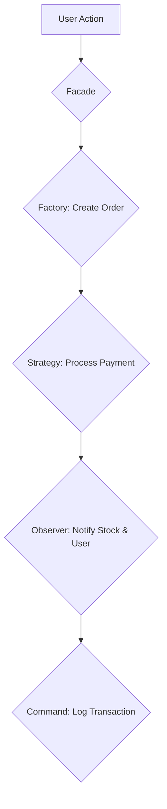

# RAK-09: Battle-Tested Case Studies

> "Di mana teori bertemu realita: Seni menggabungkan pola untuk membangun sistem raksasa."

## 1. Skenario Kekacauan (The Problem)
Pola desain dalam buku teks seringkali terlihat sangat sederhana dan terisolasi. Namun, di dunia nyata, Anda tidak hanya menggunakan satu pola. Anda harus menggabungkan 5-10 pola untuk membangun sistem yang skalabel. Tanpa pemahaman tentang cara menggabungkan pola (*Pattern Composition*), aplikasi Anda akan penuh dengan kode boilerplate dan sulit diintegrasikan.

## 2. Analogy
Pola Desain adalah seperti **Lego**. 
- Satu balok (Pola) punya kegunaan sendiri.
- Namun, untuk membangun sebuah **Kastil yang Megah** (Aplikasi), Anda harus tahu cara menyusun balok-balok tersebut agar saling mengunci dan kokoh.
- Rak ini adalah panduan untuk membangun "Kastil" tersebut.

## 3. Everyday Deep Dive (Penjelasan Santai)
Di Rak ini, kita tidak lagi belajar "Apa itu Singleton?", tapi "Bagaimana Singleton berkolaborasi dengan Factory dan Observer?". Kita akan membedah:
- **E-Commerce Engine**: Mengelola pembayaran, stok, dan pengiriman.
- **Microservices Orchestration**: Bagaimana pola-pola ini bekerja di sistem terdistribusi.
- **Game Engine**: Mengelola state karakter, efek visual, dan input user secara real-time.

## 4. The Blueprint (Composition)

## 8. Practical Lab
Struktur navigasi rak ini mengikuti **Hirarki 5-Level**:
- **[SR-01-Complex-Architectures/](./SR-01-Complex-Architectures/)**
  - [BK-01: E-Commerce Engine](./SR-01-Complex-Architectures/BK-01-E-Commerce-Engine/)
